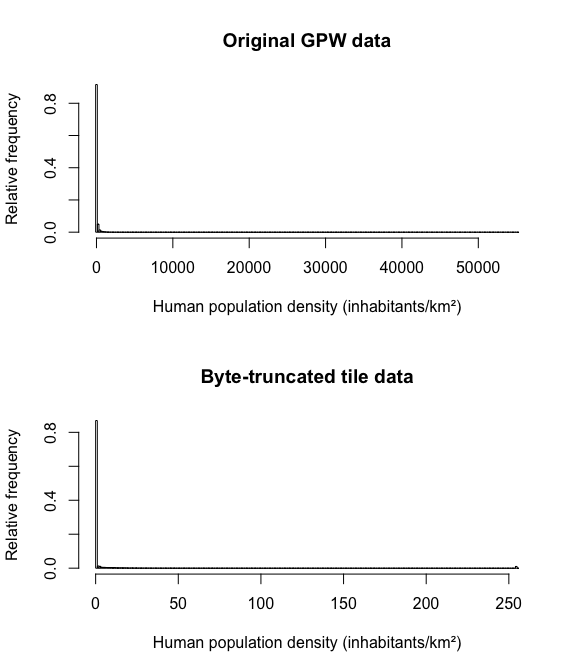

## gpw-tiles

Transparent TMS raster tiles of the [Gridded Population of the
World](http://sedac.ciesin.columbia.edu/data/set/gpw-v4-population-density-rev10)
30 arc-second population density dataset for 2015, created using
[gdal2tiles.py](http://www.gdal.org/gdal2tiles.html).

> Center for International Earth Science Information Network - CIESIN -
> Columbia University. 2017. Gridded Population of the World, Version 4
> (GPWv4): Population Density, Revision 10. Palisades, NY: NASA
> Socioeconomic Data and Applications Center (SEDAC).
> <https://doi.org/10.7927/H4DZ068D>. Accessed 8 May 2018.

The purpose of the tiles is to be used in my
[borders](https://kevinstadler.github.io/borders/) web map project, so
the original data is transformed in two ways:

1.  Population density is truncated from its original floating-point
    maximum of 55189 inhabitants/km² down to the byte-resolution
    \[0,255\] range. While this leads to significant loss of information
    about population density in urban cores, the data still captures the
    visually more relevant progression from uninhabited over rural to
    urban (see histograms below as well as Figure 4 in [this
    article](http://www.newgeography.com/content/004349-from-jurisdictional-functional-analysis-urban-cores-suburbs)).

<!-- -->

2.  To save on having to do client-side reprojection, the original
    EPSG:4326 grid is reprojected to create EPSG:3857 (Web Mercator)
    tiles.
